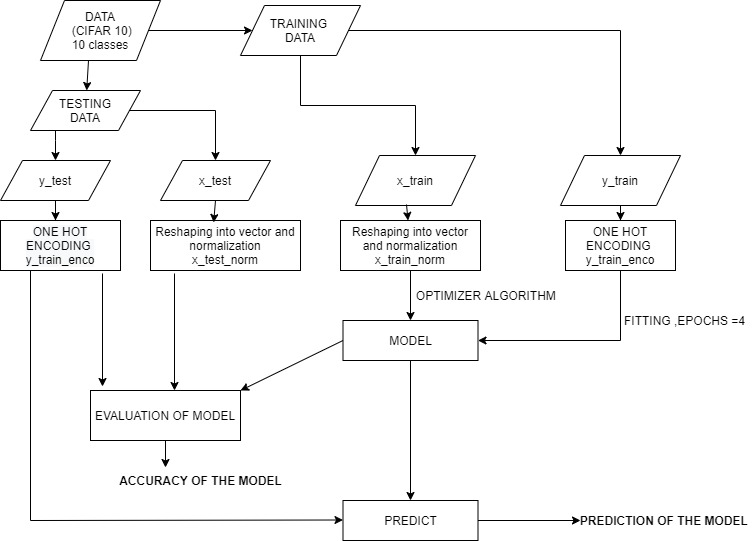

# Cifar10_ImageClassification_TensorFlow
The objective of the model is to classify images based on the 10 objects in the Cifar10 dataset and illustrate the predicted value .All the hyperparameters , algorithm and optimization techniques used can be varied accordingly to get a better result .

### _Documentation of the Project :_

### AIM : IMAGE CLASSIFICATION OR OBJECT DETECTION USING DEEP LEARNING .
_CONTENT
1)ABSTRACT
2)INTRODUCTION
3)PLATFORM USED
4)PRODUCT REQUIREMENTS
5)TECHNICAL REQUIREMENTS
6)IMAGE PRE-PROCESSING
7)OBJECT DETECTION
8)MODULE DESCRIPTION
ONE- HOT ENCODING
NORMALIZATION OF THE INPUT / TRAINING EXAMPLES
BUILDING OUR NEURAL NETWORK MODEL
9)ALGORITHM USED
STOCHASTIC GRADIENT DESCENT
LOSS FUNCTION
METRICS
10)IMPLEMENTATION
11)TESTING/EVALUATING THE MODEL
12)WORK-FLOW DIAGRAM OF THE PROJECT
13)RESULTS
14)CONCLUSION
15)FUTURE SCOPE
16)REFERENCES
17)CODE’s GITHUB LINK_

### 1)ABSTRACT
The paper embarks on predicting the outcomes of multiple images of ten objects using a deep learning approach. The main idea behind the project is to develop a model which can distinctly identify each and every object with greater accuracy . 
### 2)INTRODUCTION
 We will create an Image Recognition Classifier to classify the various  images taken from the CIFAR10 Dataset (The dataset is divided into five training batches and one test batch, each with 10000 images. The test batch contains exactly 1000 randomly-selected images from each class. The training batches contain the remaining images in random order, but some training batches may contain more images from one class than another. Between them, the training batches contain exactly 5000 images from each class. Cifar10 has ten classes in total ,they are - 'airplane', 'automobile', 'bird', 'cat', 'deer', 'dog', 'frog', 'horse', 'ship', 'truck') and hence send back the result which will have a better accuracy . For image classification there are many algorithms like Random Forest ,Logistic Regression ,Support Vector Machine etc. But we will be using CNN (Convolutional Neural Network). For the above image classification algorithms they give  more error at the prediction time, while in CNN since it is the transfer learning algorithm it will learn more data in the image classification while at the prediction time and it will give more good classification accuracy compared to other algorithms during testing .We are using two hidden layers for our neural network . The advantage of using this classifier is that the weights trained on image classification datasets can be used for the encoder. This can be considered a benefit as the image classification datasets are typically larger, such that the weights learned using these datasets are likely to be more accurate.

### 3) PLATFORM USED - 
GOOGLE COLAB (Colaboratory is a Google research project created to help disseminate machine learning education and research. It's a Jupyter notebook environment that requires no setup to use and runs entirely in the cloud.) We are saving the file in the .ipynb extension .We can use it not only for building models for machine learning but for coding in various languages and other forms of work as well .
 
### 4)PRODUCT REQUIREMENTS - 
Server , Images/Objects , Large dataset ,good RAM ,high Graphical Processing Units (GPUs) and a comparatively good CPU .
 
### 5)TECHNICAL REQUIREMENTS - Latest version of TensorFlow and Keras installed .
Wide variety of images on which the classification will be done .
Libraries include :
 
● 	Tensorflow
● 	Keras
● 	Tensorflow.keras.datasets
● 	Tensorflow.keras.utils
● 	Matplotlib
● 	Tensorflow.keras.models
● 	Tensorflow.keras.layers
 
 
### 6)IMAGE PRE-PROCESSING 
An image is nothing more than a two dimensional array of numbers (or pixel) ranging between 0 and 255. It is defined by the mathematical function f(x,y) where x and y are the two coordinates horizontally and vertically .The value of f(x,y) at any given point is giving the pixel value at that point of an image . In our model we have pre-processed the image by reading the image and then resizing it ,removing noise (denoise) etc .

### 7)OBJECT DETECTION
In our basic image classification model , we have used one input layer ,two hidden layers and an output layer in our Neural Network model to evaluate , predict the accuracy of our trained data to perfectly recognize/detect the particular object from the CIFAR 10 dataset . Below is the image of the plot where it displays the first 20 training examples  that show how well our model predicts the given pictures to the actual picture etc .
 

### 8)MODULE DESCRIPTION -
 
* 	ONE HOT ENCODING - 
One hot encoding is a process by which categorical variables are converted into a form that could be provided to ML algorithms to do a better job in prediction. The categorical value represents the numerical value of the entry in the dataset.
We will convert our each y_train and y_test labels in a list of 10 binary elements .It will help our neural network to understand which switch is ON/OFF and thereby will do a better job in prediction also .
 
* 	NORMALIZATION OF THE INPUT / TRAINING EXAMPLES - 
Normalization is a technique often applied as part of data preparation for machine learning. The goal of normalization is to change the values of numeric columns in the dataset to use a common scale, without distorting differences in the ranges of values or losing information.
We will normalize our x_train and x_test  examples (after they have been converted to their vectorized form) ie . reduce each image's pixel value to a larger extent to enhance our neural network . We will use the formula - (x_train_reshaped-x_mean)/(x_standarddeviation + epsilon) and ,
(x_test_reshaped-x_mean)/(x_standarddeviation + epsilon) .
 
* 	BUILDING OUR NEURAL NETWORK MODEL -
This is the vital part of our entire project . We will be using Sequential Class which forms a cluster of layers that is linearly stacked into tf.keras.models followed by Dense layer Dense layer is the regular deeply connected neural network layer. It is the most common and frequently used layer. Dense layer does the below operation on the input and returns the output.
 
The part of the code which shows the above implementation is :
 
From tensorflow.keras.models import Sequential
From tensorflow.keras.layers import Dense
Model = Sequential([Dense(128,activation = ‘relu’,input_shape=(3072,)),
Dense (128,activation = ‘relu’),
Dense(10,activation = ‘softmax’)])
Model.compile (optimizer=’sgd’,loss=’categorical_crossentrophy,metrics=[‘accuracy’])
Model.summary () # to display the architecture of the model

### 9)ALGORITHM USED :
 
1.	Stochastic Gradient Descent - Stochastic gradient descent (often abbreviated SGD) is an iterative method for optimizing an objective function with suitable smoothness properties (e.g. differentiable or subdifferentiable). It can be regarded as a stochastic approximation of gradient descent optimization, since it replaces the actual gradient (calculated from the entire data set) by an estimate thereof (calculated from a randomly selected subset of the data). Especially in high-dimensional optimization problems this reduces the computational burden, achieving faster iterations in trade for a lower convergence rate.
 
2.	Loss function - This measures how accurate the model is during training . Here the categorical_crossentrophy is a loss function that is used for single label categorization. This is when only one category is applicable for each data point. In other words, an example can belong to one class only. It is used to minimize the difference between the actual and predicted value and to get a greater accuracy model .
 
3.	Metrics - Used to monitor the training and testing steps. The following example uses accuracy ,the fraction of the images that are correctly classified .Accuracy is the number of correctly predicted data points out of all the data points.
 
 
### 10)IMPLEMENTATION -
 
Train the model to fit the dataset  by using the normalized value of the x_train and the encoded version of the y_train for each example and using the hyperparameter the epoch which is usually initialized before training or implementing the model .An epoch is a term used in machine learning and indicates the number of passes of the entire training dataset the machine learning algorithm has completed. Datasets are usually grouped into batches (especially when the amount of data is very large).In our example we have used epoch as four .
 
### 11)TESTING / EVALUATING THE MODEL -
 
We will evaluate the model with the help of the evaluate function and using the parameters x_train_normalized and y_test_encoded .The function does the forward pass to understand the prediction of the model and it compares with the actual y_labels .
If the accuracy obtained at this stage is equal or almost significant to the result we got during epoch , then we can clearly say our model has trained itself or else our model has just memorized the training set and hence a not-good accuracy .
  
### 12)WORK-FLOW DIAGRAM OF THE PROJECT - 

 
 
### 13)RESULTS 
We will use the predict function along with the parameter being only the normalized version of x_test and since we naturally don't compare with the y labels in prediction , therefore we are not using it also .

After fitting the model with the hyperparameters of validation split of 0.33 , epoch number = 100 ,batch_size =10 and verbose =0 , we got two graphs for the model.
Graph for the model accuracy
Graph for the model loss

Below are the screenshots of the predictions of the external images that were feeded into the model with an average accuracy of more than 70% accuracy .
                       

### 14)CONCLUSION 
With this , our image classification algorithm has worked successfully for multi - class classification images in the CIFAR 10 dataset with an accuracy of 50 % approx .
We can change this accuracy for the betterment of our model by changing the hyperparameters or by using a better algorithm , by working on a better and more diverse dataset etc .

### 15)FUTURE SCOPE
Researchers all over the world are still working on creating models for image classification that mimic the human brain. They are using neural networks, AI, ML, computer vision, and many other technologies in this research. In the future, we may come across robots that would be capable of performing recognizing images just like humans.
### 16)REFERENCES
_https://intellipaat.com/blog/future-scope-of-machine-learning/#:~:text=Researchers%20all%20over%20the%20world,tasks%20similar%20to%20a%20human._
Google.com
Deeplearning.ai
coursera .com
https://towardsdatascience.com/random-initialization-for-neural-networks-a-thing-of-the-past-bfcdd806bf9e
https://www.investopedia.com/terms/n/neuralnetwork.asp#:~:text=A%20neural%20network%20is%20a,organic%20or%20artificial%20in%20nature.
https://www.tensorflow.org/tutorials/images/classification
https://towardsdatascience.com/image-pre-processing-c1aec0be3edf

### Link for Technical Design Document for this project :

https://docs.google.com/document/d/1RVYEzXDqNVHXdGtVcOW-13lmLle8oA0i1uIEksDifzc/edit

### _If you've read it so far , Kudos to you . Happy Learning !_
